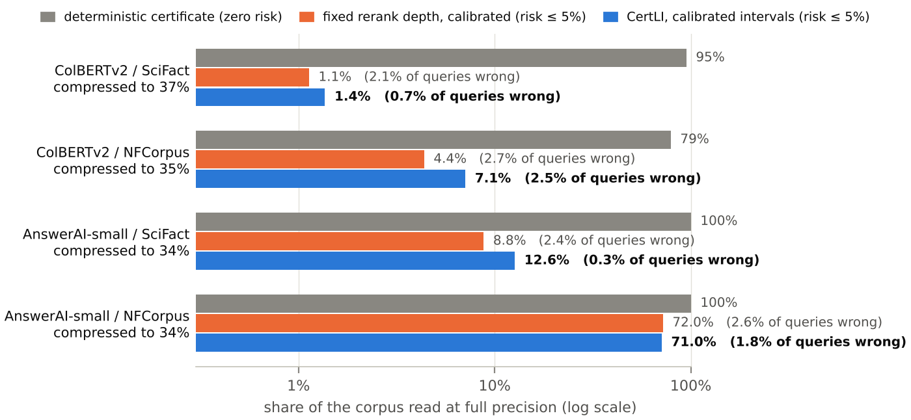

# CertLI: certified top-k retrieval from compressed late-interaction indexes

**Question.** Can a compressed multi-vector (ColBERT-style) index *prove* that it returns the exact MaxSim top-10, and how much of the corpus must it score at full precision to do so?

This repository holds the complete implementation and every result behind the report **[`report/report.pdf`](report/report.pdf)** (*CertLI: First Experiments*, 4 pages). Every number in the report is read from a JSON file in [`results/`](results) by a single script ([`exp/make_report_assets.py`](exp/make_report_assets.py)), so each claim can be traced to a file and to the script that wrote it. A one-page follow-up, **[`report/eigenli_vs_certli.pdf`](report/eigenli_vs_certli.pdf)**, compares CertLI with EigenLI on nDCG@10 (see [EigenLI comparison](#eigenli-comparison)).

---

## Headline result



| Model / corpus | Code size (% of fp16) | Deterministic certificate | **Calibrated CertLI** (risk ≤ 5%) | Calibrated fixed depth | Oracle stopping |
|---|---|---|---|---|---|
| ColBERTv2 / SciFact | 37% | 94.8% | **1.4%** (0.7% wrong) | 1.1% (2.1% wrong) | 0.4% |
| ColBERTv2 / NFCorpus | 35% | 78.9% | **7.1%** (2.5% wrong) | 4.4% (2.7% wrong) | 0.7% |
| AnswerAI-small / SciFact | 34% | 100% | **12.6%** (0.3% wrong) | 8.8% (2.4% wrong) | 1.3% |
| AnswerAI-small / NFCorpus | 34% | 100% | **71.0%** (1.8% wrong) | 72.0% (2.6% wrong) | 14.4% |

Share of the corpus scored at full precision per query. In brackets: realised share of held-out queries whose top-10 differs from exact MaxSim. Calibration: Learn-then-Test, α = 0.05, δ = 0.1, mean over 200 random 50/50 calibration/test splits. Oracle: a perfect per-query stopping rule.

**Findings**

1. **The math holds on real models.** The corpus-mean shift (Lemma 1) changes no ranking (max score deviation 4.4e-6, identical top-100 for all queries) and the interval bounds (Lemma 2) were never violated in 50.3M (query, document) checks.
2. **Deterministic certificates do not pay off at useful compression.** At about one third of the fp16 index, proving the exact top-10 needs 79% to 95% of the corpus for ColBERTv2 and 100% for AnswerAI-small.
3. **The reason is measurable.** The coding error is close to isotropic with respect to the query, so the realised error is a median 5% of its worst-case bound, while the top-10 is decided by tiny margins (median gap between the 10th and 11th exact scores 0.003 to 0.096, against a mean interval slack of 5 to 11).
4. **Calibrated certificates work, with an honest caveat.** Shrinking the same intervals with a Learn-then-Test factor scores 1.4% to 12.6% of the corpus in three of four settings with the risk controlled. A fixed rerank depth calibrated the same way is equally cheap, so today the gain comes from calibration, not from per-query adaptivity; an oracle stopping rule shows 3 to 7 times headroom.
5. **Anisotropy matters for spectral scores.** AnswerAI-small tokens share one dominant direction (random cross-document token cosine 0.82 to 0.84). Removing it is rank-safe for MaxSim (Lemma 1), but removing it from documents only collapses an EigenLI-style projection score from 68.0 to 1.6 nDCG@10; removing it from both sides is neutral to helpful.

## EigenLI comparison

EigenLI as defined in its paper (Archish S et al., arXiv:2609.07561): each document keeps the top-`k` eigenvectors of its token second-moment matrix and is scored by `sum_i |Pi_D q_i|^2` (re-implemented in [`exp/run_approx.py`](exp/run_approx.py)). nDCG@10:

| Model / corpus | Exact MaxSim | EigenLI k=16 | EigenLI k=32 | k=32, corpus mean removed | k=24 + 8 farthest tokens |
|---|---|---|---|---|---|
| ColBERTv2 / SciFact | 69.3 | 63.6 | 67.7 | 66.6 (-1.1) | 67.0 (-0.7) |
| ColBERTv2 / NFCorpus | 34.4 | 30.4 | 31.9 | 31.0 (-0.9) | 32.0 (+0.1) |
| AnswerAI-small / SciFact | 74.5 | 68.0 | 67.4 | **69.6 (+2.2)** | **68.9 (+1.5)** |
| AnswerAI-small / NFCorpus | 37.0 | 28.7 | 28.0 | **31.8 (+3.8)** | 27.5 (-0.5) |

| Model / corpus | EigenLI k=32 | CertLI index, no rescoring (memory) | Calibrated CertLI (rescored) | EigenLI k=32 + calibrated rescoring (rescored) | Exact MaxSim |
|---|---|---|---|---|---|
| ColBERTv2 / SciFact | 67.7 | 69.6 (37%) | 69.3 (1.4%) | 69.1 (8.7%) | 69.3 |
| ColBERTv2 / NFCorpus | 31.9 | 33.8 (35%) | 34.0 (7.1%) | 34.1 (73.1%) | 34.4 |
| AnswerAI-small / SciFact | 67.4 | 70.7 (34%) | 74.7 (12.6%) | 73.4 (24.4%) | 74.5 |
| AnswerAI-small / NFCorpus | 28.0 | 29.1 (34%) | 36.6 (71.0%) | 36.6 (78.1%) | 37.0 |

* **Same memory.** Removing one corpus-wide mean from documents and queries (CertLI's Lemma 1 shift, not per-text centring) improves EigenLI on the anisotropic AnswerAI-small by 2.2 and 3.8 points and costs about 1 point on ColBERTv2. Spending 8 of 32 vectors on the tokens farthest from the subspace helps only on AnswerAI/SciFact. The 3/4 to 1/4 split was fixed in advance; other splits are in `results/eigen_sparse/`.
* **With exact rescoring.** Calibrated CertLI (Learn-then-Test, at most 5% of queries with a top-10 different from exact MaxSim) comes within 0.4 points of exact MaxSim and rescores fewer documents than EigenLI used as the first stage of the same procedure.
* Commands: `python exp/eigen_sparse.py <model>/<corpus> ...`, `python exp/eigen_rescore.py <model>/<corpus> ...` (the latter needs the bound matrices from `run_cert.py`), then `python exp/make_eigen_report.py`.

---

## Method in brief

For a query `Q = {q_i}` with weights `w_i` and a document `D = {d_j}` (unit-norm token vectors), MaxSim (weighted Chamfer) is

```
C_w(Q, D) = sum_i  w_i * max_j <q_i, d_j>
```

* **Lemma 1 (mean shift).** For any vector `mu`, `C_w(Q, D - mu) = C_w(Q, D) - sum_i w_i <q_i, mu>`. The offset depends only on the query, so shifting every document token by the corpus mean leaves every ranking unchanged. Per-document centring does not have this property.
* **Low-rank-plus-sparse (LRS) code.** Each shifted document is projected on its own top-`k_D` eigenbasis `U_D` (`k_D` in {4, 8, 16, 32}, chosen per document to minimise bytes). Tokens whose off-subspace residual exceeds `tau` are stored verbatim. The rest are grouped by farthest-point (k-center) clustering inside the subspace; each cluster stores a centre `z_c` (an actual token's projection), an in-subspace radius `eps_c`, a residual radius `tau_c`, a full-space radius and the centre token's own residual `rho_c`.
* **Lemma 2 (interval bounds).** For a query token `q` with in-subspace part `U_D^T q` and off-subspace part `q_perp`, every token `d` of cluster `c` satisfies
  `<q, d> <= <q, z_c> + min(eps_c*|U_D^T q| + tau_c*|q_perp|, full_c*|q|)`,
  and the cluster's best token scores at least `<q, z_c> - rho_c*|q_perp|`. Taking the max over clusters and verbatim tokens, then the weighted sum over query tokens, gives `L_D <= C_w(Q, D) <= U_D`. Implementation: `IntervalCode` in [`src/codec.py`](src/codec.py).
* **Certification.** Score documents exactly in decreasing order of `U_D` and stop when the next `U_D` falls below the current 10th best exact score. This scores exactly `{D : U_D >= s_(10)}`, which any correct method must score given these bounds (Seidl and Kriegel, SIGMOD 1998). Reported cost = that set's size as a share of the corpus.
* **Calibrated variant.** Replace `U_D` by `S_hat_D + lambda * (U_D - S_hat_D)`, where `S_hat_D` is the code's point estimate, and choose `lambda` with Learn-then-Test (Angelopoulos et al., 2021): binary loss `1{top-10 != exact}`, fixed-sequence binomial tests from `lambda = 1` downwards, α = 0.05, δ = 0.1. `lambda = 1` is the deterministic certificate.
* **Other codes certified with the same bounds.** POOL (k-center clusters in the full space, no subspace) and a PLAID-style residual code (4096 global centroids, `b`-bit per-dimension residual buckets, and a per-token error radius rounded up to 1 byte so the bounds stay valid).

---

## Repository layout

```
src/
  data.py        BEIR loading; nDCG@10 / recall / MRR with trec_eval conventions
  encode.py      PyLate ColBERT encoding of corpora and queries -> emb/<model>/<dataset>/
  core.py        Corpus container, exact (weighted) MaxSim over the whole corpus, IDF weights
  codec.py       LRS / POOL / RQ codes, byte accounting, vectorised interval bounds (Lemma 2)
  certify.py     bound-ordered refinement, sweeps, Learn-then-Test selection
exp/
  run_exact.py         E1  exact MaxSim, IDF weights, Lemma 1 check, per-document centring
  run_structure.py     E2  geometry of token sets (anisotropy, spectra, residual vs IDF)
  run_cert.py          E3  build codes, compute bounds, certify (deterministic)
  run_slack.py         E4  token-level slack: isotropy of the coding error
  analyze_realized.py  E5  where the exact score sits inside its interval; top-10 gaps
  analyze_stop.py      E6  calibrated stopping: shrink / offset / fixed depth under Learn-then-Test
  analyze_oracle.py    E7  oracle per-query stopping depth
  run_eigen.py         E8  EigenLI-style projection score with and without the mean shift; Ward pooling
  run_approx.py            helpers for E8 (pooling, projection score, top-k overlap)
  make_report_assets.py    tables/*.tex, figs/*, results/final_numbers.json from results/
  eigen_sparse.py          EigenLI vs corpus-mean removal vs low-rank + sparse EigenLI at equal memory
  eigen_rescore.py         calibrated exact rescoring: CertLI vs EigenLI as first stage
  make_eigen_report.py     tables/e1.tex, e2.tex, results/eigen_numbers.json
scripts/
  download.sh    BEIR SciFact + NFCorpus and the two checkpoints into assets/
  run_all.sh     the full pipeline in the order used for the report
results/         every result file used in the report (JSON)
tables/ figs/    generated LaTeX table bodies and figures
report/          report.tex, body.tex, report.pdf; eigenli_vs_certli.tex/.pdf (follow-up)
```

---

## Reproducing

**Environment.** Python 3.13, CPU only (the report was produced on 2 CPU cores and 7 GB RAM). Tested versions: torch 2.14.1, numpy 2.5.3, scipy 1.18.1, scikit-learn 1.9.1, pylate 1.6.0, transformers 4.57.3, sentence-transformers 5.3.0, matplotlib 3.11.2.

```bash
pip install -r requirements.txt
bash scripts/download.sh      # ~0.7 GB into assets/
bash scripts/run_all.sh       # full pipeline, about 3 to 4 hours on 2 CPU cores
```

Paths are resolved relative to the repository root; set `CERTLI_ROOT` to use another location for `assets/`, `emb/` and `results/`.

To rebuild only the tables, figures and report from the committed results (seconds):

```bash
python exp/make_report_assets.py
cd report && pdflatex report.tex && pdflatex report.tex
```

### Experiments, files and report items

| | Question | Command (per model, corpus) | Output | Report | Time (2 cores) |
|---|---|---|---|---|---|
| E0 | Encode | `python src/encode.py <model> scifact nfcorpus --bf16` | `emb/` (not committed) | | 3 to 12 min per corpus |
| E1 | Does exact MaxSim reproduce published nDCG? Does Lemma 1 hold? | `python exp/run_exact.py <model> scifact nfcorpus` | `results/exact/` | Table 1 | ~3 min per corpus |
| E2 | Is the low-rank-plus-sparse structure real? | `python exp/run_structure.py <model> scifact nfcorpus` | `results/structure/` | Table 2 | ~1 min |
| E3 | How much does a deterministic certificate read? | `python exp/run_cert.py <model> <corpus> --suite main` (`--suite full` for the 3 x 3 grid) | `results/cert/` and `results/bounds/*.npz` (bounds not committed, 120 MB) | Table 3, Fig. 1 | 12 to 23 min |
| E4 | Is the coding error isotropic? | `python exp/run_slack.py <model> scifact nfcorpus` | `results/slack/` | Table 4 | ~30 s |
| E5 | Where does the exact score sit inside its interval? | `python exp/analyze_realized.py` | `results/realized/` | Table 4, Fig. 2 | ~2 min |
| E6 | Calibrated certificates and baselines | `python exp/analyze_stop.py` | `results/stop/all.json` | Table 5, Fig. 1 | ~5 min per bounds file |
| E7 | Headroom for adaptive stopping | `python exp/analyze_oracle.py` | `results/oracle/all.json` | Table 5 | ~1 min |
| E8 | Mean shift and EigenLI-style scoring | `python exp/run_eigen.py <model> scifact` | `results/approx/` | Table 6 | ~5 min |

Models: `colbertv2` (colbert-ir/colbertv2.0, 128-d) and `answerai-small` (answerdotai/answerai-colbert-small-v1, 96-d). Corpora: BEIR `scifact` (5,183 documents, 300 test queries) and `nfcorpus` (3,633 documents, 323 test queries).

### Result files

* `results/exact/<model>__<corpus>.json`: nDCG@10, recall@100, MRR@10 for unweighted and IDF-weighted MaxSim; Lemma 1 deviation; per-document centring.
* `results/cert/<model>__<corpus>__w1__<suite>.json`: one row per code configuration (bytes, share of corpus scored: mean / median / p90 / max, violations, slack statistics, build and bound time). `__extra.json` holds per-query arrays and the λ / depth sweeps.
* `results/stop/all.json`: for each saved bounds file, the full grids of the three stopping families (shrink λ, constant offset, fixed depth) with reads, error and recall, plus Learn-then-Test selections at α = 0.05 and 0.10.
* `results/final_numbers.json`: every number printed in the report, as read by `make_report_assets.py`.

---

## Implementation notes and transparency

* **Ground truth.** Exact MaxSim against every document (float32 products, float64 accumulation). No candidate generator is involved, so certification cost is measured against the full corpus.
* **Encoding.** PyLate with each model's query and document prefixes, `[MASK]` query expansion to 32 tokens, the punctuation skiplist, documents truncated at 300 tokens. Encoding ran under bf16 autocast on CPU; vectors are then cast to fp32, re-normalised and stored as fp16. Exact nDCG@10 matches published numbers within 0.6 points (Table 1).
* **Byte accounting.** All stored floats count 2 bytes. LRS bytes per document = `2 * (d*k + n_clusters*(k + 4) + n_verbatim*d)`. The full index is `2 * d * n_tokens`. `tau` and `eps` are given in units of the RMS shifted-token norm.
* **Weights.** All certification results use unweighted MaxSim (`w_i = 1`). IDF weights appear only in Table 1.
* **Grids.** ColBERTv2/SciFact was the first setting run, with the full 3 x 3 (`tau`, `eps`) grid plus POOL at two radii; its file keeps the suite name `main`. The reduced grid now in `--suite main` was used for the other three settings. The ColBERTv2/SciFact bound matrix for the calibration analysis was regenerated with `--suite bonly`, which reproduced the original row exactly (36.7% of fp16, 94.8% scored).
* **PLAID-style codes.** The first 1, 2 and 4-bit runs ran out of memory on the 7 GB machine; the memory-safe implementation now in `codec.py` produced the 1-bit result in the report (AnswerAI/NFCorpus, 8% of fp16, 100% scored). The 2-bit runs (`--suite rq2`, 14% of fp16) finished after the report was written and are not in its tables: zero bound violations; the deterministic certificate scores 90% (ColBERTv2/SciFact), 73% (ColBERTv2/NFCorpus) and 100% (AnswerAI-small) of the corpus. Files: `results/cert/*__rq2.json`.
* **Calibration statistics.** λ is selected on the calibration half of each split and evaluated on the other half; reported numbers are means over 200 splits. With about 160 test queries, the realised error of an individual split can exceed α by sampling noise (at most 14% of splits, ColBERTv2/NFCorpus) while the mean stays at or below 2.5%; the Learn-then-Test guarantee concerns the population risk.
* **EigenLI.** `run_eigen.py` is my re-implementation of a projection-energy score `sum_i w_i |Pi_D q_i|^2` with `Pi_D` the top-`k` eigenspace of the document's token second-moment matrix. It is not the authors' code and may differ from the published method.
* **Seeds.** All sampling, clustering and calibration splits use fixed seeds (0).

## Limitations

Small corpora (3.6k and 5.2k documents), CPU only, two models, 300 to 323 queries per corpus. The next steps in the report (randomised radii via rotation or dither, a learned stopping rule, MS MARCO and LoTTE with PLAID candidate generation) are not implemented here.

## License

MIT, see [LICENSE](LICENSE).
